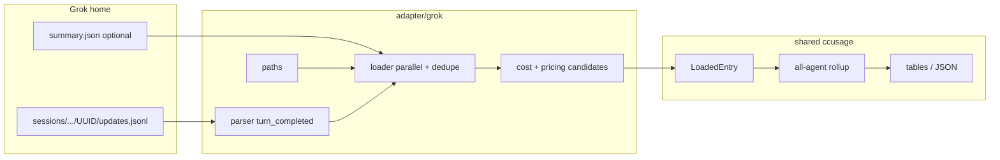

# feat: Add Grok CLI usage adapter

## Goal Capsule

- **Objective:** Make Grok Build CLI usage visible in `ccusage` daily/monthly/session reports with token totals and estimated USD cost, using local session files under `~/.grok/sessions`.
- **Authority:** This plan; adapter architecture in `rust/crates/ccusage/src/adapter/README.md` and `adapter/AGENTS.md`; local pricing patch conventions in `LOCAL_PRICING_PATCH.md`.
- **Stop when:** `ccusage grok daily` and unified `ccusage daily` show Grok models from real local data; fixture tests pass; release binary rebuilt for the local wrapper; docs no longer claim Grok CLI is unsupported.
- **Out of scope:** Scraping xAI cloud billing APIs; estimating tokens from transcript text; changing other agents' loaders beyond registration hooks.

## Product Contract

### Summary

Users who run Grok Build CLI heavily currently see **no Grok line** in `ccusage` because there is no adapter. Grok now writes per-turn token accounting on `turn_completed` events in session `updates.jsonl`. This plan adds a first-class `grok` agent source, pricing for the models in active use (`grok-4.5`, `grok-composer-2.5-fast`), and docs so Grok usage rolls into the unified report.

Product Contract preservation: N/A (ce-plan-bootstrap; no upstream brainstorm).

### Requirements

- R1. `ccusage` discovers Grok session data under the default Grok home (`~/.grok`) and optional overrides (`GROK_HOME`, `--grok-path` / config).
- R2. Only billable turn usage is loaded: `sessionUpdate == "turn_completed"` records that carry `usage.modelUsage` (or top-level usage with model identity).
- R3. Each model in `modelUsage` becomes one or more `LoadedEntry` rows with input, output, cache-read, and reasoning token fields mapped into ccusage's token model.
- R4. Cost in calculate/auto modes bills `reasoningTokens` at the **output** rate (Goose pattern), while totals still account for reasoning via `extra_total_tokens`.
- R5. Embedded fixed prices exist for `grok-4.5` and `grok-composer-2.5-fast` (and keep existing `grok-4.3` / `grok-build-0.1` entries). Unknown models warn missing-pricing rather than invent rates.
- R6. Users can run `ccusage grok daily|monthly|session` and see Grok included in unified `ccusage daily` when data exists.
- R7. Docs and Source Support Q&A reverse the "Grok CLI not supported" guidance and document paths, env, flags, and caveats.
- R8. Local wrapper continues to point at the rebuilt release binary so normal `ccusage` picks up Grok without special flags.

### Actors

- A1. Interactive CLI user checking multi-agent spend.
- A2. Local custom-fixes maintainer rebuilding the release binary.

### Key Flows

- F1. User runs `ccusage daily --breakdown` → Grok rows appear under Agent/Models when `~/.grok/sessions` has recent `turn_completed` usage.
- F2. User runs `ccusage grok daily --since … --until … --json` → JSON totals match sum of fixture/local turn usage for that window.
- F3. User sets `GROK_HOME` or `--grok-path` to an alternate data root → only that tree is scanned.

### Acceptance Examples

- AE1. Fixture with two `turn_completed` events (mixed models) → loader yields two entries, correct per-model tokens, non-zero cost for priced models.
- AE2. Session with only tool updates / `totalTokens` meta and no `turn_completed` usage → zero entries (no invented usage).
- AE3. Live smoke (skipped unless local data present): `ccusage grok daily --since <today>` returns rows for machines with active Grok use.
- AE4. Unified daily "Detected:" line includes Grok when data is present.

### Scope Boundaries

**In scope**

- New `adapter/grok` module (paths, parser, loader, report, mod).
- CLI/command/config/progress/all-agent registration.
- Pricing entries + cost mapping for active Grok model IDs.
- Docs: guide page, index table, source-support Q&A, related links/nav.
- Rebuild local release binary used by the shell wrapper.

**Out of scope**

- Headless SDK-only streams that never write `updates.jsonl`.
- Estimating tokens from `chat_history.jsonl` text.
- Upstream PR process (may happen later; this plan targets this checkout).
- Changing the default cost mode of the shell wrapper.

**Deferred to Follow-Up Work**

- Official models.dev / LiteLLM sync for Grok model IDs (local fixed rates first).
- Blocks/statusline integration if Grok lacks Claude-style billing blocks.
- Subagent double-count audit refinements if parent turns ever embed child totals (see Open Questions).

---

## Planning Contract

### Assumptions

- Grok's `turn_completed.usage` values are **per-turn** (not cumulative session totals). Confirmed on live data: consecutive turns can go down as well as up.
- `timestamp` on `updates.jsonl` lines is Unix seconds (UTC-based grouping via existing timezone helpers).
- `GROK_HOME` unset means `~/.grok` (matches current CLI auth/log layout).
- Display model labels should use a `[grok]` prefix in multi-agent views, matching OpenClaw/pi conventions.
- Exact public USD rates for `grok-4.5` / `grok-composer-2.5-fast` may need a short docs lookup at implementation time; if unavailable, use documented provisional rates aligned with nearby Grok coding models and record the source in `pricing.rs` comments / `LOCAL_PRICING_PATCH.md`.

### Key Technical Decisions

- KTD1. **Source of truth:** Parse `**/updates.jsonl` under `<grok-home>/sessions/`. Ignore `worktrees.db` (no token accounting). Prefer `usage.modelUsage` over coarse `tokens_used` on `subagent_finished`.
- KTD2. **Granularity:** One `LoadedEntry` per `(turn, model)` from `modelUsage`. Multi-model turns emit multiple entries sharing session id and timestamp.
- KTD3. **Reasoning cost:** Mirror Goose — store reasoning in `extra_total_tokens`; for cost calculation, bill `output_tokens + reasoning_tokens` at the output unit price. Do not double-count reasoning in displayed output token columns.
- KTD4. **Project/session identity:** Session id = directory name (UUID). Project path prefer `summary.json` `info.cwd` / `git_root_dir` when present; else URL-decode the parent path segment under `sessions/`.
- KTD5. **Walk strategy:** Discover `updates.jsonl` files (and optional sibling `summary.json` for metadata). Use `read_files_parallel` like OpenClaw. Fast detection short-circuits once any usable file exists for "detected agents" banners.
- KTD6. **Dedupe key:** Prefer `_meta.eventId` when present; else stable hash of session id + timestamp + model + token tuple so re-reads do not inflate totals.
- KTD7. **Pricing:** Extend embedded fixed-price map (existing local patch path) for `grok-4.5` and `grok-composer-2.5-fast`; keep `grok-4.3` / `grok-build-0.1`. Use candidate keys: raw model id, optional `xai/<model>`.
- KTD8. **Registration surface:** Full first-class agent — `Command::Grok`, config schema, `UsageLoadAgent::Grok`, `adapter/all` loader entry, help text, docs guide.

### High-Level Technical Design



**Directional parse sketch (not implementation code):**

```text
for each line in updates.jsonl:
  if method not session update: skip
  update = params.update
  if update.sessionUpdate != "turn_completed": skip
  usage = update.usage or empty
  models = usage.modelUsage or { currentModel: usage }
  for (model, u) in models:
    emit entry(
      input=u.inputTokens,
      output=u.outputTokens,
      cache_read=u.cachedReadTokens,
      reasoning=u.reasoningTokens,
      ts=line.timestamp,
      session=params.sessionId
    )
```

### Alternatives Considered

| Approach | Why not |
|---|---|
| Keep pricing-only for Grok models in other agents | User's Grok TUI traffic never appears; that was the observed gap. |
| Estimate tokens from chat history text | Explicitly forbidden by product policy and Source Support Q&A. |
| Scrape xAI cloud usage | ccusage is local read-only; no authenticated cloud scraping. |
| Session-level max snapshot instead of per-turn sum | Under-counts multi-turn sessions; live data shows per-turn independence. |

### Risks and Dependencies

| Risk | Mitigation |
|---|---|
| Parent turn usage already includes subagent tokens, and child sessions also emit `turn_completed` → double count | During U2/U3, sample a parent+child pair; if double-count proven, exclude nested `subagents/` session paths or filter child sessions. Default: load every session dir's `turn_completed` until evidence says otherwise; document the choice. |
| Schema drift (field renames) | Lenient serde + fixture tests; skipped live smoke test. |
| Provisional pricing wrong | Fixed rates documented; easy override via `pricingOverrides` / rebuild. |
| Large session trees slow load | Parallel file reads; only open `updates.jsonl` (not chat history). |

### Open Questions

- OQ1 (deferred): Confirm whether parent `turn_completed` usage includes child subagent API usage. Resolve during implementation with one live multi-subagent session; record the rule in `adapter/grok/README.md`.
- OQ2 (deferred): Final public list prices for `grok-4.5` and `grok-composer-2.5-fast` — look up at implement time from xAI docs; if missing, provisional rates with comment.

---

## Implementation Units

### U1. Grok path discovery and adapter skeleton

**Goal:** Create the `adapter/grok` module shell and discover session roots/files without parsing usage yet.

**Requirements:** R1

**Dependencies:** None

**Files:**

- `rust/crates/ccusage/src/adapter/grok/mod.rs` (create)
- `rust/crates/ccusage/src/adapter/grok/paths.rs` (create)
- `rust/crates/ccusage/src/adapter/mod.rs` (modify)
- `rust/crates/ccusage/src/adapter/grok/paths.rs` tests via `ccusage_test_support::fs_fixture`

**Approach:**

- Default roots: `$GROK_HOME` if set (comma-separated allowed), else `~/.grok`.
- Optional CLI/config custom path mirrors OpenClaw's multi-root list.
- Collect `sessions/**/updates.jsonl` (skip symlinks). Optionally pair each with sibling `summary.json`.
- Export empty/stub `load_entries` returning `Ok(vec![])` so later units can wire CLI without unfinished parse.

**Patterns to follow:** `adapter/openclaw/paths.rs`, `adapter/hermes/paths.rs` env overrides.

**Test scenarios:**

- Env `GROK_HOME` pointing at a fixture with nested session `updates.jsonl` → discovery returns that file.
- Missing home / empty sessions → empty list, no error.
- Comma-separated roots → both scanned; dedupe by canonical path.

**Verification:** Unit tests green; module compiles with `adapter::grok` registered in `adapter/mod.rs`.

---

### U2. Parse `turn_completed` usage into LoadedEntry

**Goal:** Convert JSONL lines into typed usage rows with correct token mapping and timestamps.

**Requirements:** R2, R3, R4 (field mapping only; cost can be 0 until U3)

**Dependencies:** U1

**Files:**

- `rust/crates/ccusage/src/adapter/grok/parser.rs` (create)
- `rust/crates/ccusage/src/adapter/grok/loader.rs` (create/extend)
- Fixture JSONL under test fixtures (inline `fs_fixture!` or `tests/fixtures/grok/` if repo prefers files)

**Approach:**

- Serde structs for the minimal envelope: `timestamp`, `params.sessionId`, `params.update.sessionUpdate`, `params.update.usage`, `params._meta.eventId`.
- Map camelCase token fields → `TokenUsageRaw` (`cachedReadTokens` → `cache_read_input_tokens`; `reasoningTokens` → `extra_total_tokens`).
- Timestamp: Unix seconds → millis via existing helpers (same idea as Goose).
- Model label: raw id for pricing candidates; displayed model `[grok] <id>` for multi-agent distinction.
- Skip lines that are not `turn_completed` or lack any positive token counts.

**Patterns to follow:** `adapter/openclaw/parser.rs` (JSONL + prefilter), `adapter/goose/parser.rs` (reasoning / timestamp).

**Execution note:** Implement parser tests before wiring cost so token mapping is locked.

**Test scenarios:**

- Happy path: one model, all token fields present → correct `LoadedEntry` usage and date under UTC.
- Multi-model `modelUsage` → one entry per model.
- Zero-token / missing usage → skipped.
- Non-`turn_completed` lines with large `totalTokens` meta only → ignored.
- Timestamp seconds vs millis edge: values like `1783901683` group to the correct calendar day in a fixed timezone.

**Verification:** Parser unit tests only; no CLI smoke required yet.

---

### U3. Loader aggregation, cost, and pricing candidates

**Goal:** Parallel load, dedupe, cost calculation with reasoning-as-output billing, missing-pricing warnings.

**Requirements:** R3, R4, R5

**Dependencies:** U2

**Files:**

- `rust/crates/ccusage/src/adapter/grok/loader.rs` (modify)
- `rust/crates/ccusage/src/adapter/grok/parser.rs` (cost helpers)
- `rust/crates/ccusage/src/pricing.rs` (modify — model rates)
- `LOCAL_PRICING_PATCH.md` (modify — document new rates)

**Approach:**

- `track_usage_load(UsageLoadAgent::Grok, …)` wrapper.
- `read_files_parallel` over discovered `updates.jsonl` files.
- Cost helper mirrors Goose: `output_tokens + reasoning_tokens` for pricing; display usage keeps original output.
- Pricing candidates: model id, `xai/{model}` if useful.
- Embed fixed rates for `grok-4.5` and `grok-composer-2.5-fast`; update context limits if known (e.g. 500k for 4.5 from models cache).
- Resolve OQ1 with a quick parent/child sample before finalizing which paths load.

**Patterns to follow:** `calculate_goose_cost`, local `fixed_cached_input_pricing` helpers already in `pricing.rs`.

**Test scenarios:**

- Priced model fixture → cost > 0 and matches hand calculation for known rates.
- Unknown model with tokens → cost 0 + `missing_pricing_model` set.
- Dedupe: duplicate `eventId` twice → single entry.
- Reasoning-only addition: output=100, reasoning=50 → cost uses 150 output units; displayed output tokens remain 100; `extra_total_tokens` includes 50.

**Verification:** Focused cargo tests for grok parser/loader/pricing.

---

### U4. CLI command, config, progress, and all-agent rollup

**Goal:** Expose `ccusage grok …` and include Grok in unified reports when data exists.

**Requirements:** R6, R8

**Dependencies:** U3

**Files:**

- `rust/crates/ccusage-cli/src/types.rs` (modify — `Command::Grok`)
- CLI parse/help wiring in the clap/parser module(s) under `rust/crates/ccusage-cli/` (modify as required)
- `rust/crates/ccusage/src/main.rs` (modify — dispatch)
- `rust/crates/ccusage/src/progress.rs` (modify — `UsageLoadAgent::Grok`)
- `rust/crates/ccusage/src/adapter/all/loader.rs` (modify)
- `rust/crates/ccusage/src/adapter/all/report.rs` (modify — display name)
- `rust/crates/ccusage/src/config.rs` / `config_schema.rs` (modify — grok path options)
- `rust/crates/ccusage/src/adapter/grok/report.rs` (create)
- `rust/crates/ccusage/src/adapter/grok/mod.rs` (run entry)

**Approach:**

- Mirror Hermes/OpenClaw agent command args (`daily`/`monthly`/`session` kinds already shared).
- Optional `--grok-path` analogous to `--open-claw-path`.
- All-agent detection should list Grok only when path discovery finds usable files (existing short-circuit pattern).

**Patterns to follow:** `adapter/hermes/mod.rs` `run`, `adapter/all/loader.rs` agent table.

**Test scenarios:**

- CLI help includes `grok`.
- Integration-style test: fixture `GROK_HOME` + `ccusage`-level load path returns summaries for daily kind (prefer unit-level summarize tests if full CLI harness is heavy).
- All-agent loader includes grok agent key when fixture present.

**Verification:** `cargo test -p ccusage` covering new registration; manual `ccusage grok --help`.

---

### U5. Docs and Source Support Q&A

**Goal:** User-facing documentation matches the new agent.

**Requirements:** R7

**Dependencies:** U4 (command names/flags stable)

**Files:**

- `docs/guide/grok/index.md` (create)
- `docs/guide/index.md` (modify — agent table)
- `docs/guide/all-reports.md` (modify)
- `docs/guide/source-support-qa.md` (modify — remove/replace "Grok not supported")
- VitePress nav under `docs/` (modify as existing agents do)
- `apps/ccusage/README.md` and/or root README agent list if they enumerate agents
- `rust/crates/ccusage/src/adapter/grok/README.md` (create — path/schema notes)
- `.agents/skills/agent-sources/SKILL.md` (modify — point at Grok README)

**Approach:** Follow OpenClaw guide structure: install invocation examples, data paths, env/flags, sample table, JSON sample, limitations (local only; reasoning billed as output for cost).

**Test expectation:** none — documentation only; link-check via normal docs workflow if available.

**Verification:** Docs skill audit checklist satisfied for user-facing agent addition.

---

### U6. Local binary rebuild and smoke validation

**Goal:** The machine's normal `ccusage` command reports Grok usage.

**Requirements:** R8, AE3, AE4

**Dependencies:** U1–U5

**Files:**

- `LOCAL_PRICING_PATCH.md` (modify — mention Grok adapter + rebuild steps)
- No source beyond rebuild if already complete

**Approach:**

- `cargo +stable build --manifest-path rust/Cargo.toml --locked -p ccusage --release`
- Confirm wrapper still targets `rust/target/release/ccusage`
- Smoke: `ccusage grok daily --since <yesterday> --breakdown` and unified `ccusage daily --since <yesterday> --breakdown`
- Confirm models `grok-4.5` / `grok-composer-2.5-fast` appear with non-zero tokens

**Execution note:** Prefer install/runtime smoke verification over additional unit tests for this unit.

**Test expectation:** none beyond smoke outcomes above.

**Verification:** Live report shows Grok; version string still 20.x from this checkout.

---

## Verification Contract

- Focused: `cargo +stable test --manifest-path rust/Cargo.toml --locked -p ccusage` (or package-filtered grok/pricing tests during iteration).
- Format: `just fmt` / rustfmt when Rust files change.
- Smoke (local data present):
  - `ccusage grok daily --since 2026-07-12 --until 2026-07-13 --breakdown`
  - `ccusage daily --since 2026-07-12 --until 2026-07-13 --breakdown` includes Grok in Detected + table.
- Docs: manual spot-check of guide page and Source Support Q&A.
- Rebuild release binary after tests pass so the wrapper path is current.

## Definition of Done

- [ ] U1–U6 complete.
- [ ] Fixture tests cover parse, multi-model, skip non-usage lines, cost+reasoning, path discovery.
- [ ] `ccusage grok` command works; unified daily detects Grok when data exists.
- [ ] Pricing present for `grok-4.5` and `grok-composer-2.5-fast`; missing-pricing for unknowns.
- [ ] Docs no longer claim Grok CLI is unsupported; new guide exists.
- [ ] Local release binary rebuilt and smoke-tested against real `~/.grok` data.
- [ ] Parent/child double-count decision documented in adapter README.

## Appendix

### Evidence from pre-plan investigation

- Official docs previously said Grok local DB lacked token accounting; live Grok 0.2.x sessions now write full `usage` on `turn_completed`.
- Last ~24h on the authoring machine (sum of turn events): ~190M input / ~2M output for `grok-4.5`, ~94M input for `grok-composer-2.5-fast` — all invisible to current `ccusage`.
- Local pricing patch already prices other agents and older Grok model keys, but has **no adapter** and **no** `grok-4.5` / `grok-composer-2.5-fast` rates.

### Pattern references

| Concern | Follow |
|---|---|
| JSONL session walk | `adapter/openclaw/` |
| Reasoning → cost as output | `adapter/goose/parser.rs` `calculate_goose_cost` |
| Agent `run` + report | `adapter/hermes/mod.rs` |
| All-agent registration | `adapter/all/loader.rs` |
| Fixed local rates | `pricing.rs` + `LOCAL_PRICING_PATCH.md` |
| New agent docs | `docs/guide/openclaw/index.md` |

### Sources & Research

- Local research only: adapter architecture docs, OpenClaw/Goose/Hermes adapters, live `~/.grok/sessions` samples.
- External research skipped for architecture (strong in-repo patterns). Pricing URLs to consult at implement time: xAI developer pricing docs (same source comment style as existing Grok entries in `pricing.rs`).
